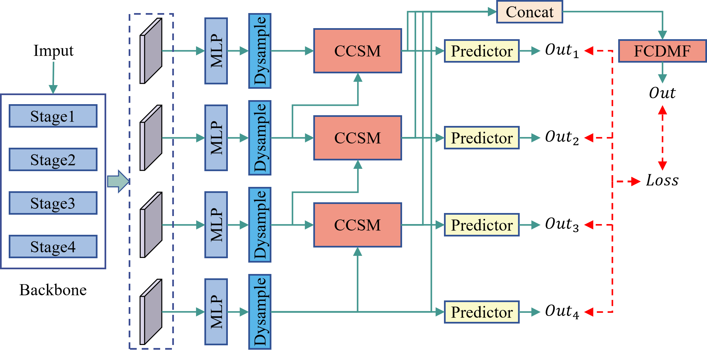
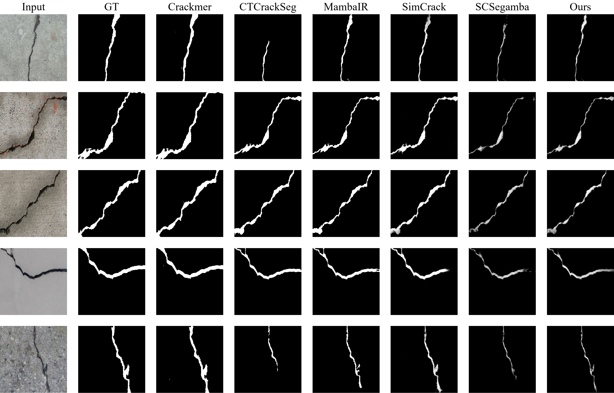

# HCVMamba
## Hybrid Cross-Scale Visual State-Space Model for Structural Crack Segmentation and Visual Integrity Assessment

[](https://doi.org/10.5281/zenodo.20205286)

This repository contains the official PyTorch implementation of HCVMamba. This work is currently under review at *The Visual Computer*.

---

## Updates
- [x] Release full training and evaluation scripts
- [x] Release environment configuration file
- [x] Release pretrained checkpoints and sample predictions
- [x] Add method description and experiment results
- [x] Sync checkpoints to GitHub Releases

---

## Method Overview
HCVMamba is a visual state-space based network for accurate structural crack segmentation. It adopts a hybrid cross-scale design with two dedicated modules to enhance crack structure completeness and boundary clarity under multi-scale complex scenes.
<div align="center">  <br> <em>Figure: Overall pipeline of the proposed HCVMamba.</em> </div>

## Qualitative Results
<div align="center">
  
</div>
The above figure shows the qualitative comparison results between HCVMamba and mainstream methods on DeepCrack, Crack500, and CrackMap datasets. It can be seen that our method has improved the continuity and boundary integrity of fine cracks.

---

## Getting Started

### 1. Environment Setup
We provide two ways to configure the running environment.

**Option 1: Create conda environment manually**
```shell
conda create -n HCVMamba python=3.10 -y
conda activate HCVMamba

pip install torch==1.13.1+cu116 torchvision==0.14.1+cu116 -f https://download.pytorch.org/whl/torch_stable.html

pip install -U openmim
mim install mmcv-full

pip install mamba-ssm==1.2.0
pip install timm lmdb mmengine numpy opencv-python
```

**Option 2: Install via requirements.txt**
```shell
pip install -r requirements.txt
```
> Note: mmcv-full is recommended to be installed via `mim` for better CUDA compatibility.

### 2. Dataset Preparation
Experiments are conducted on three public crack segmentation datasets:
- DeepCrack: https://github.com/qinnzou/DeepCrack
- Crack500: https://github.com/fyangneil/pavement-crack-detection
- CrackMap: https://github.com/ikatsamenis/CrackMap

Please download the raw datasets from their official repositories.
- **Data preprocessing and train/val/test split protocols** follow the standard settings of SCSegMamba: https://github.com/Karl1109/SCSegamba
- All datasets share a unified configuration logic. You only need to modify the dataset path and corresponding hyperparameters in the training script.

### 3. Training
Modify the training configurations (dataset path, batch size, learning rate, etc.) in `main.py`, then start training:
```shell
python main.py
```
- A fixed random seed is set in the training script to ensure fully reproducible experimental results.

### 4. Inference & Evaluation
The inference and evaluation pipelines are integrated in the provided scripts. After generating prediction results, compute the evaluation metrics with:
```shell
python eval_compute.py

cd eval
python evaluate.py
```
Please modify the dataset path and prediction result path according to your local environment before evaluation.

### 5. Pretrained Checkpoints & Sample Predictions
Pretrained model weights on all three datasets and sample prediction masks are available at:
> Baidu Netdisk: https://pan.baidu.com/s/1H7KDtp1huK2WnwGtZZJnSA?pwd=qau7
> Extraction code: `qau7`

We will sync these resources to GitHub Releases in subsequent updates.

---

## License
This project is released under the **Apache 2.0** license.

## Archived Version
The stable permanent archived version of this code is hosted on Zenodo:
DOI: https://doi.org/10.5281/zenodo.20205286

---

## Citation
If you find this work useful for your research, please cite:
```bibtex
@article{sun2026hybrid,
  title={Hybrid Cross-Scale Visual State-Space Model for Structural Crack Segmentation and Visual Integrity Assessment},
  author={Sun, Mingsi and Yan, Lelei and Song, Pinyi and Zhao, Hongwei and Shao, Xue},
  journal={The Visual Computer, under review},
  year={2026}
}
```
*Formal citation information will be updated after the paper is officially accepted.*

---

## Acknowledgment
This work is built upon the following open-source projects:

- [SCSegamba](https://github.com/Karl1109/SCSegamba) [[Paper]](https://doi.org/10.48550/arXiv.2503.01113)
- [DeepCrack](https://github.com/yhlleo/DeepCrack) [[Paper]](https://doi.org/10.1016/j.neucom.2019.01.036)
- [Crack500](https://github.com/fyangneil/pavement-crack-detection) [[Paper]](https://doi.org/10.1109/TITS.2019.2910595)
- [CrackMap](https://github.com/ikatsamenis/CrackMap) [[Paper]](https://doi.org/10.1007/978-3-031-47969-4_16)

---
